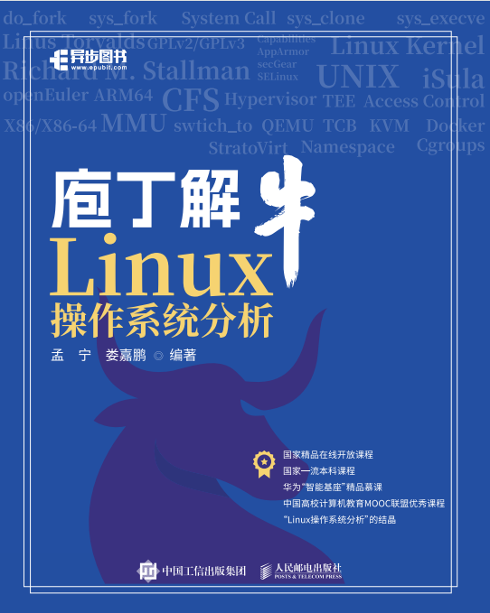

# 庖丁解牛Linux操作系统分析

### 第1章 Linux操作系统概览

- 1.1 自由软件江湖里的码头和规矩
- 1.2 操作系统成长记
- 1.3 国产操作系统概述
- 1.4 与Linux 的第一次亲密接触
- 1.5 openEuler操作系统中的常用Linux命令参考

### 第2章 计算机系统的基本工作原理

- 2.1 存储程序计算机
- 2.2 X86汇编语言基础
- 2.3 ARM64汇编语言基础
- 2.4 指令乱序问题
- 2.5 编写一个最精简的操作系统内核

### 第3章 Linux内核源代码及调试环境

- 3.1 Linux内核源代码
- 3.2 搭建 Linux 内核调试环境
- 3.3 跟踪 Linux 内核的启动过程

### 第4章 深入理解系统调用

- 4.1 系统调用概述
- 4.2 触发系统调用的方法
- 4.3 深入理解X86 Linux系统调用
- 4.4 深入理解ARM64 Linux系统调用

### 第5章 进程的描述和进程的创建

- 5.1 进程的描述
- 5.2 进程地址空间
- 5.3 进程的创建

### 第6章 可执行程序工作原理

- 6.1 ELF目标文件格式
- 6.2 程序的编译过程
- 6.3 链接与库
- 6.4 可执行程序的装载
- 6.5 系统调用、fork和execve总结

### 第7章 中断处理、内核线程和设备驱动框架

- 7.1 中断处理概述
- 7.2 内核线程概述
- 7.3 设备驱动程序

### 第8章 进程调度与进程切换

- 8.1 进程调度概述
- 8.2 进程调度的时机
- 8.3 进程上下文切换

### 第9章 Linux系统的软件结构

- 9.1 Linux系统的一般执行过程
- 9.2 Linux系统架构

### 第10章 KVM及虚拟机技术

- 10.1 虚拟机技术概述
- 10.2 使用KVM API创建一个虚拟机
- 10.3 QEMU-KVM虚拟机的实现原理
- 10.4 StratoVirt虚拟机

### 第11章 Linux容器技术

- 11.1 容器技术概述
- 11.2 Linux容器技术的基本原理
- 11.3 如何创建一个容器
- 11.4 Docker
- 11.5 iSula

### 第12章 Linux系统安全相关技术

- 12.1. 操作系统安全概述
- 12.2. Linux系统的安全机制
- 12.3. Linux系统的访问控制
- 12.4. 可信计算和机密计算

* [Linux内核分析MOOC课程](http://mooc.study.163.com/course/USTC-1000029000) 
* [庖丁解牛Linux网络核心](https://blog.51cto.com/cloumn/detail/32)

## 参考资料

- https://gitee.com/mengning997/mykernel
- [Linux内核分析MOOC课程](http://mooc.study.163.com/course/USTC-1000029000) 
- [庖丁解牛Linux网络核心](https://blog.51cto.com/cloumn/detail/32)
- https://www.shiyanlou.com/courses/195
- [https://github.com/torvalds/linux/tree/v5.4](https://gitee.com/mirrors/linux/tree/v5.4/)
- [Linux kernel v3.18](https://github.com/torvalds/linux/tree/b2776bf7149bddd1f4161f14f79520f17fc1d71d)
- https://github.com/torvalds/linux
- https://gitee.com/openeuler
- https://gitee.com/openharmony

## Contact us

